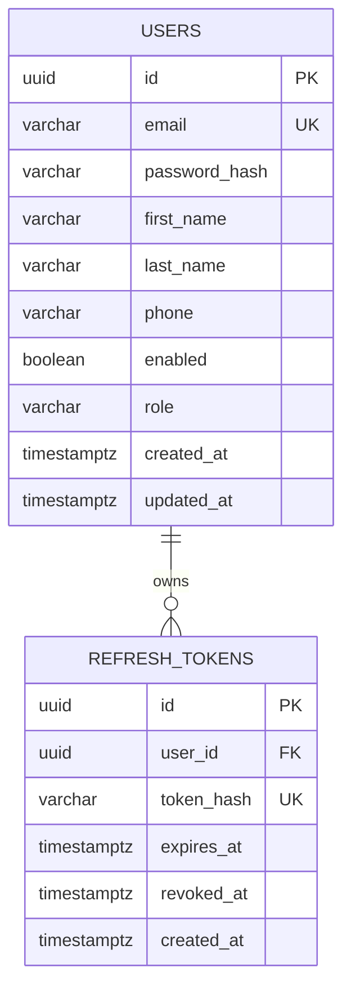

# Database

PostgreSQL is the source of truth. Flyway owns schema changes and Hibernate uses
`ddl-auto=validate` outside tests.

## Milestone 1 schema

`users.email` is normalized to lowercase and uniquely indexed. Refresh-token
digests are uniquely indexed for constant-time lookup. Expiry and revocation are
stored separately to support rotation and auditability. Application-generated
UUIDs avoid sequential public identifiers and database-extension requirements.

Future migrations add Product/ProductVariant/Inventory, Cart/CartItem,
Order/OrderItem, StockReservation, and Payment without changing the auth tables.
