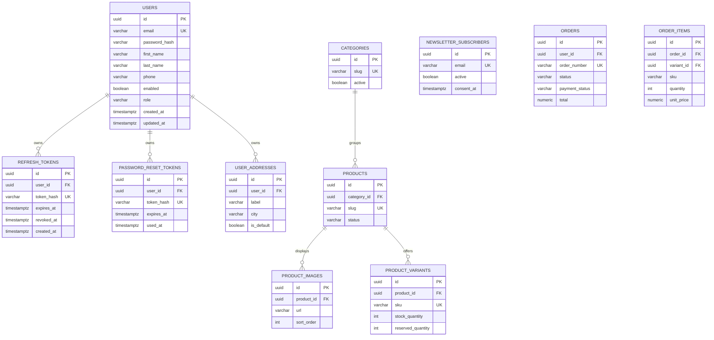

# Database

PostgreSQL is the source of truth. Flyway owns schema changes and Hibernate uses
`ddl-auto=validate` outside tests.

## Current schema

`users.email` is normalized to lowercase and uniquely indexed. Refresh-token
digests are uniquely indexed for constant-time lookup. Expiry and revocation are
stored separately to support rotation and auditability. Application-generated
UUIDs avoid sequential public identifiers and database-extension requirements.

Order and item snapshots are introduced in V7. Variant `reserved_quantity`
separates temporarily held inventory from sold stock. A future migration can
add persisted payment events and server carts without changing order history.
